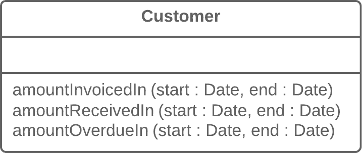
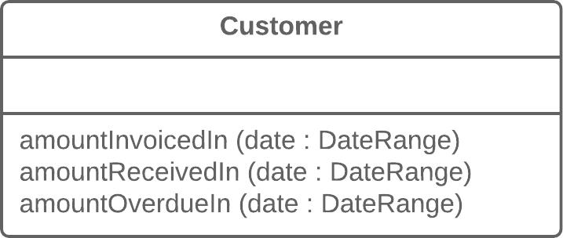

####Long Methods 

As a rule of thumb, if you feel the need to <b>comment on something inside a method</b>, you should take this code and put it in a new method. Even a single line can and should be split off into a separate method, if it requires explanations. And if the method has a descriptive name, nobody will need to look at the code to see what it does.

#####Recipe 1 

Extract Method

```java 
void printOwing() {
  printBanner();

  // Print details.
  System.out.println("name: " + name);
  System.out.println("amount: " + getOutstanding());
}
```

To 

```java 
void printOwing() {
  printBanner();
  printDetails(getOutstanding());
}

void printDetails(double outstanding) {
  System.out.println("name: " + name);
  System.out.println("amount: " + outstanding);
}
```

#####Recipe 2 :

Reduce Local Variables and Parameters Before Extracting a Method
If local variables and parameters interfere with extracting a method, use 
1. Replace Temp with Query, 
2. Introduce Parameter Object or 
3. Preserve Whole Object</b>.

######Replace Temp with Query

```
double calculateTotal() {
  double basePrice = quantity * itemPrice;
  if (basePrice > 1000) {
    return basePrice * 0.95;
  }
  else {
    return basePrice * 0.98;
  }
}
```
To 

```
double calculateTotal() {
  if (basePrice() > 1000) {
    return basePrice() * 0.95;
  }
  else {
    return basePrice() * 0.98;
  }
}
double basePrice() {
  return quantity * itemPrice;
}
```

######Introduce Parameter Object
If local variables and parameters interfere with extracting a method, use Replace Temp with Query, Introduce Parameter Object or Preserve Whole Object.

Problem
Your methods contain a repeating group of parameters.

   
   
   source : refactoring.guru
   
Solution
   
   
   
   source : refactoring.guru
   
   
######Preserve Whole Object
If local variables and parameters interfere with extracting a method, use Replace Temp with Query, Introduce Parameter Object or Preserve Whole Object.
   
   
Problem 

You get several values from an object and then pass them as parameters to a method.

```
int low = daysTempRange.getLow();
int high = daysTempRange.getHigh();
boolean withinPlan = plan.withinRange(low, high);
```

Instead, try passing the whole object.

```

boolean withinPlan = plan.withinRange(daysTempRange);
```


#####Recipe #3
Replace <b> Method with Method Object</b>
If none of the previous recipes help, try moving the entire method to a separate object via Replace Method with Method Object.

You have a long method in which the local variables are so intertwined that you can't apply Extract Method.

```

class Order {
  // ...
  public double price() {
    double primaryBasePrice;
    double secondaryBasePrice;
    double tertiaryBasePrice;
    // Perform long computation.
  }
}

```

Transform the method into a separate class so that the local variables become fields of the class. Then you can split the method into several methods within the same class.

```
class Order {
  // ...
  public double price() {
    return new PriceCalculator(this).compute();
  }
}

class PriceCalculator {
  private double primaryBasePrice;
  private double secondaryBasePrice;
  private double tertiaryBasePrice;
  
  public PriceCalculator(Order order) {
    // Copy relevant information from the
    // order object.
  }
  
  public double compute() {
    // Perform long computation.
  }
}
```


#####Recipe #4
Conditionals and Loops

Conditional operators and loops are a good clue that code can be moved to a separate method. For conditionals, use <b>Decompose Conditional</b>. If loops are in the way, try <b>Extract Method</b>.


######Decompose Conditional
Conditional operators and loops are a good clue that code can be moved to a separate method. For conditionals, use Decompose Conditional. If loops are in the way, try Extract Method.
Problem
You have a complex conditional (if-then/else or switch).

```
if (date.before(SUMMER_START) || date.after(SUMMER_END)) {
  charge = quantity * winterRate + winterServiceCharge;
} else {
  charge = quantity * summerRate;
}
```

Decompose the complicated parts of the conditional into separate methods: the condition, then and else.

```
if (isSummer(date)) {
  charge = summerCharge(quantity);
} else {
  charge = winterCharge(quantity);
}
```

######Extract Method
You have a code fragment that can be grouped together.

```

void printProperties(List users) {
  for (int i = 0; i < users.size(); i++) {
    String result = "";
    result += users.get(i).getName();
    result += " ";
    result += users.get(i).getAge();
    System.out.println(result);

    // ...
  }
}
```

Move this code to a separate new method (or function) and replace the old code with a call to the method.

```
void printProperties(List users) {
  for (User user : users) {
    System.out.println(getProperties(user));

    // ...
  }
}

String getProperties(User user)  {
  return user.getName() + " " + user.getAge();
 }

```
######A Few Words on Performance
Does an increase in the number of methods hurt performance, as many people claim? In almost all cases the impact is so negligible that it's not even worth worrying about.

Plus, now that you have clear and understandable code, you're more likely to find truly effective methods for restructuring code and getting real performance gains if the need ever arises.

####Large Class

#####Recipe #1

######Extract Class
Extract Class helps if part of the behavior of the large class can be spun off into a separate component.

Problem
When one class does the work of two, awkwardness results.


   
   
   source : refactoring.guru
   
Solution

Instead, create a new class and place the fields and methods responsible for the relevant functionality in it.
   
   
   
   source : refactoring.guru
   
#####Recipe #2

######Extract Subclass

Extract Subclass helps if part of the behavior of the large class can be implemented in different ways or is used in rare cases.

#####Recipe #3

######Extract Interface

Extract Interface helps if it's necessary to have a list of the operations and behaviors that the client can use.
